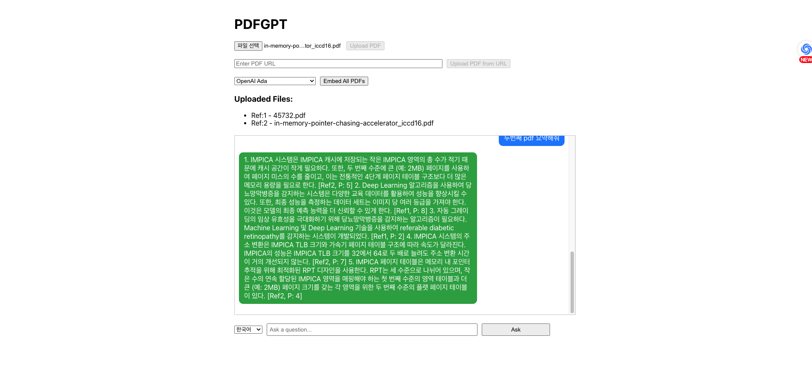

# PDFGPT

## Overview

PDFGPT is an advanced PDF Question Answering (QA) system that leverages Natural Language Processing (NLP) and machine learning models to provide intelligent responses to queries about PDF content. This project combines a FastAPI backend server with a React frontend client, all containerized using Docker for seamless deployment and scalability.

The system processes uploaded PDFs, extracts text, and utilizes cutting-edge NLP techniques to deliver accurate and context-aware answers to user queries. By integrating powerful language models and semantic search capabilities, PDFGPT offers an efficient solution for extracting information from lengthy documents.

This project was inspired by and aims to improve upon the functionality of [https://github.com/bhaskatripathi/pdfGPT](https://github.com/bhaskatripathi/pdfGPT). Due to operational issues with the original implementation, PDFGPT was developed as a more robust and reliable alternative, incorporating additional features and optimizations to enhance performance and user experience.

## Screenshot

Below is a screenshot of PDFGPT in action:



## Purpose and Description

PDFGPT is designed to revolutionize the way users interact with PDF documents. By allowing users to upload PDFs and ask questions about their content, PDFGPT eliminates the need for manual searching through lengthy documents. The system processes PDFs, extracts text, and utilizes cutting-edge NLP techniques to deliver accurate and context-aware answers to user queries.

### Key Features
- Effortless PDF upload and processing
- **Multi-file support**: Ability to upload and process multiple PDF files simultaneously, allowing users to query across multiple documents.
- **Deferred text embedding**: Upload PDFs first, then perform text embedding for all uploaded files when ready.
- Advanced text extraction and embedding
- Semantic search for pinpointing relevant content
- AI-powered question answering using state-of-the-art language models
- Intuitive web interface for seamless user interaction
- Choice between two text embedding models: Universal Sentence Encoder (USE) and OpenAI's Ada v2 (ADA)
- Bilingual answer generation: Option to receive answers in English or Korean

PDFGPT is invaluable across various domains including research, education, legal, and information retrieval, where quick access to specific information within extensive documents is crucial.

## Technology Stack

PDFGPT utilizes a modern and robust technology stack to provide efficient PDF processing and question answering capabilities.

### Backend (Server)
- **Framework**: FastAPI - A modern, fast (high-performance) web framework for building APIs with Python 3.7+ based on standard Python type hints.
- **Language**: Python 3.11+
- **Key Libraries and Models**:
  - `tensorflow` and `tensorflow-hub` for machine learning and NLP tasks
  - **Universal Sentence Encoder** (Version 4) - A pre-trained model from TensorFlow Hub used for generating sentence embeddings.
  - **OpenAI Ada v2** - A text embedding model from OpenAI that converts text into high-dimensional vectors, enabling semantic search and improving QA accuracy.
  - `PyMuPDF` for PDF processing
  - `scikit-learn` for machine learning utilities
  - `numpy` for numerical computations
  - `openai` for OpenAI API integration to leverage advanced language models
- **API Documentation**: Swagger UI (automatically generated by FastAPI)
- **Containerization**: Docker

### Frontend (Client)
- **Framework**: React - A JavaScript library for building user interfaces
- **Language**: JavaScript/TypeScript
- **Key Libraries**:
  - `axios` for HTTP requests
  - (If used, mention other significant libraries like `react-router`, `redux`, etc.)
- **Containerization**: Docker
- **Web Server**: Nginx (for serving the built React app)

### Infrastructure
- **Container Orchestration**: Docker Compose
- **Reverse Proxy**: Nginx - Used to route requests to the appropriate service (client or server)
- **Environment Variables**: Used for configuration and sensitive data management (e.g., OPENAI_API_KEY)

### API Integration
- OpenAI API (or similar LLM API) for advanced natural language processing tasks

### Key AI Components
1. **Text Embedding**: Universal Sentence Encoder (USE) from TensorFlow Hub
   - Converts text into 512-dimensional vectors
   - Enables efficient semantic search and comparison of text segments
2. **OpenAI Ada v2**: A powerful text embedding model that enhances semantic search and question-answering accuracy.
3. **Question Answering**: Leveraging LLM capabilities through OpenAI API or similar services
   - Generates context-aware answers based on the embedded text and user queries

This stack ensures high performance, scalability, and ease of deployment, making PDFGPT a robust solution for PDF-based question answering. The combination of USE for text embedding, OpenAI Ada v2, and advanced LLMs for question answering provides a powerful foundation for understanding and processing document content.

## API Documentation

PDFGPT provides comprehensive API documentation using Swagger UI and ReDoc. After starting the application, you can access the API documentation at the following URLs:

- Swagger UI: [http://localhost:8000/docs](http://localhost:8000/docs)
- ReDoc: [http://localhost:8000/redoc](http://localhost:8000/redoc)

## How to Run

### Prerequisites

- Docker and Docker Compose installed on your system
- Git (optional, for cloning the repository)
- OpenAI API key
  - You need to sign up for an OpenAI account and obtain an API key
  - Visit [OpenAI's website](https://openai.com/) to create an account and generate an API key
- Rename `.env.sample` to `.env` and update it with your OpenAI API key and other configuration settings.

### Steps to Run

1. Clone the repository (if not already done):
    ```bash
    $ git clone https://github.com/tuxxon/PDFGPT.git
    $ cd PDFGPT
    ```

2. Build and start the Docker containers:
    ```bash
    $ docker compose up -d --build
    ```

   **Note**: The first time you start the containers, it may take 1-2 minutes for the backend to be fully ready. You can monitor the server logs to ensure it is running by using the following command:
   ```bash
   $ docker logs pdfgpt-server-1 -f
    INFO:     Started server process [1]
    INFO:     Waiting for application startup.
    INFO:     Application startup complete.
    INFO:     Uvicorn running on http://0.0.0.0:8000 (Press CTRL+C to quit)
   ```


3. Once the containers are up and running, access PDFGPT:
    - Frontend: Open a web browser and navigate to `http://localhost` or `http://localhost:3000` 
    - Backend API: Available at `http://localhost:8000`

4. To stop PDFGPT:
    ```bash
    $ docker compose down
    ```
